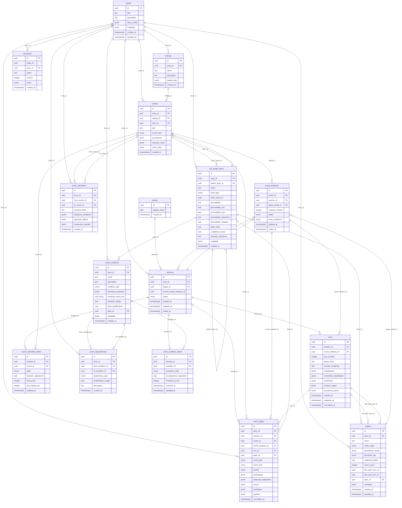
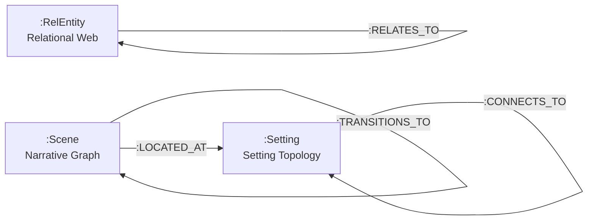

# Storyteller Database Schema

> Auto-generated from SQL migration analysis. Do not edit manually.
>
> Regenerate with: `cargo make generate-db-schema`

The Storyteller database uses PostgreSQL 18 with Apache AGE for graph queries.
All tables use UUID v7 primary keys (`uuidv7()`) for time-ordered identifiers.
The schema lives in the `public` schema (no schema prefix).

## Entity Relationship Diagram

## Enum Types

| Enum | Values |
|------|--------|
| `event_priority` | immediate, high, normal, low, deferred |
| `event_type` | atom, compound |
| `event_kind` | state_assertion, action_occurrence, spatial_change, relational_shift, information_transfer, unknown |
| `provisional_status` | hypothesized, rendered, committed |
| `scene_type` | gravitational, connective, gate, threshold |
| `entity_origin` | authored, promoted, generated |
| `persistence_mode` | permanent, scene_local, ephemeral |
| `promotion_tier` | unmentioned, mentioned, referenced, tracked, persistent |
| `session_status` | created, active, suspended, ended |
| `scene_instance_status` | active, completed, abandoned |
| `layer_type` | memory, dream, fairy_tale, parallel_pov, embedded_text, epistle |
| `scene_provenance` | authored, collaborative, generated |
| `scene_activation` | dormant, approaching, active, completed, bypassed |
| `condition_type` | prerequisite, discovery, gate, emergent, exclusion |
| `dependency_type` | requires, excludes, enables, amplifies |
| `resolution_state` | unresolved, resolved, excluded, unreachable |

## Tables

| # | Table | Columns | Description |
|---|-------|---------|-------------|
| 1 | `stories` | 7 | Top-level story container |
| 2 | `settings` | 6 | Spatial locations for scenes (setting topology vertices) |
| 3 | `sub_graph_layers` | 16 | Narrative sub-graph layers for tales-within-tales |
| 4 | `scenes` | 10 | Scene templates with gravitational mass and cast |
| 5 | `players` | 3 | Player identity |
| 6 | `entities` | 14 | Entity lifecycle tracking with promotion tiers |
| 7 | `sessions` | 8 | Player session lifecycle |
| 8 | `scene_instances` | 9 | Specific playthrough of a scene within a session |
| 9 | `characters` | 7 | Versioned character sheets (tensor snapshots) |
| 10 | `turns` | 14 | Atomic unit of play — player input through rendering |
| 11 | `event_ledger` | 16 | Append-only record of committed events |
| 12 | `scene_transitions` | 9 | Authored metadata for possible scene transitions |
| 13 | `scene_activation_states` | 8 | Session-scoped scene activation lifecycle |
| 14 | `event_conditions` | 12 | DAG nodes — narrative conditions resolvable during play |
| 15 | `event_dependencies` | 8 | DAG edges — typed relationships between conditions |
| 16 | `event_condition_states` | 8 | Session-scoped event condition resolution tracking |

## Foreign Key Relationships

| Source Table | Column | Target Table | Target Column |
|-------------|--------|-------------|---------------|
| `settings` | `story_id` | `stories` | `id` |
| `sub_graph_layers` | `story_id` | `stories` | `id` |
| `sub_graph_layers` | `parent_layer_id` | `sub_graph_layers` | `id` |
| `scenes` | `story_id` | `stories` | `id` |
| `scenes` | `setting_id` | `settings` | `id` |
| `scenes` | `layer_id` | `sub_graph_layers` | `id` |
| `entities` | `story_id` | `stories` | `id` |
| `entities` | `layer_id` | `sub_graph_layers` | `id` |
| `sessions` | `story_id` | `stories` | `id` |
| `sessions` | `player_id` | `players` | `id` |
| `scene_instances` | `scene_id` | `scenes` | `id` |
| `scene_instances` | `session_id` | `sessions` | `id` |
| `scene_instances` | `player_entity_id` | `entities` | `id` |
| `characters` | `story_id` | `stories` | `id` |
| `turns` | `session_id` | `sessions` | `id` |
| `turns` | `scene_instance_id` | `scene_instances` | `id` |
| `event_ledger` | `story_id` | `stories` | `id` |
| `event_ledger` | `session_id` | `sessions` | `id` |
| `event_ledger` | `scene_id` | `scenes` | `id` |
| `event_ledger` | `scene_instance_id` | `scene_instances` | `id` |
| `event_ledger` | `turn_id` | `turns` | `id` |
| `event_ledger` | `layer_id` | `sub_graph_layers` | `id` |
| `scene_transitions` | `story_id` | `stories` | `id` |
| `scene_transitions` | `from_scene_id` | `scenes` | `id` |
| `scene_transitions` | `to_scene_id` | `scenes` | `id` |
| `scene_activation_states` | `session_id` | `sessions` | `id` |
| `scene_activation_states` | `scene_id` | `scenes` | `id` |
| `event_conditions` | `story_id` | `stories` | `id` |
| `event_conditions` | `layer_id` | `sub_graph_layers` | `id` |
| `event_dependencies` | `story_id` | `stories` | `id` |
| `event_dependencies` | `from_condition_id` | `event_conditions` | `id` |
| `event_dependencies` | `to_condition_id` | `event_conditions` | `id` |
| `event_condition_states` | `session_id` | `sessions` | `id` |
| `event_condition_states` | `condition_id` | `event_conditions` | `id` |
| `sub_graph_layers` | `entry_scene_id` | `scenes` | `id` |
| `sessions` | `current_scene_instance_id` | `scene_instances` | `id` |
| `entities` | `first_seen_turn_id` | `turns` | `id` |
| `entities` | `last_seen_turn_id` | `turns` | `id` |

## SQL Functions and Views

### Functions

| Function | Description |
|----------|-------------|
| `calculate_event_dependency_levels(input_story_id uuid)` | Compute topological levels in the Event DAG via recursive CTE |
| `get_evaluable_frontier( input_session_id uuid, input_story_id uuid )` | Find conditions whose requirements are met and can be evaluated |
| `get_transitive_dependencies(target_condition_id uuid)` | Walk dependency chain to find all transitive ancestors |

### Views

| View | Description |
|------|-------------|
| `event_dag_overview` | Structural overview: parent/child counts, root/leaf detection, dependency depth |

## Apache AGE Graph Schema (Planned)

> These graph labels are **planned for TAS-244/245** and are not yet migrated.
> Source: `cargo-make/scripts/graph-schema.toml`

### Vertex Labels

| Label | Graph | Properties | Description |
|-------|-------|------------|-------------|
| `:RelEntity` | Relational Web | `pg_id UUID`, `name TEXT`, `entity_type TEXT` | Character/entity node in the relational web |
| `:Setting` | Setting Topology | `pg_id UUID`, `name TEXT`, `traversal_cost FLOAT` | Physical location node in the setting topology |
| `:Scene` | Narrative Graph | `pg_id UUID`, `title TEXT`, `scene_type TEXT`, `mass FLOAT` | Scene node in the narrative graph with gravitational mass |

### Edge Labels

| Label | Graph | From | To | Properties | Description |
|-------|-------|------|----|------------|-------------|
| `:RELATES_TO` | Relational Web | :RelEntity | :RelEntity | `substrate_dimensions JSONB`, `tension FLOAT` | Relational substrate between entities |
| `:CONNECTS_TO` | Setting Topology | :Setting | :Setting | `traversal_cost FLOAT`, `bidirectional BOOLEAN` | Spatial connection between settings |
| `:TRANSITIONS_TO` | Narrative Graph | :Scene | :Scene | `transition_weight FLOAT` | Scene transition with gravitational weight |
| `:LOCATED_AT` | Cross-Graph | :Scene | :Setting |  | Cross-graph link: scene to its physical setting |

---

*Generated by `generate-db-schema.sh` from storyteller-storykeeper SQL migration analysis*
